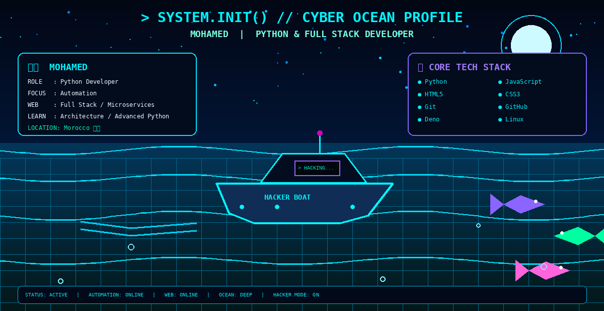

  

        

  <h3>⚡ Python Developer | Automation Enthusiast | Web Creator ⚡</h3>    
  
      
      
      
  
  
  
💻 System Overview (About Me)
class Developer:
def init(self):
self.name = "Mohamed"
self.role = "Python & Full Stack Developer"
self.location = "Morocco 🇲🇦"
self.current_focus = ["Automation", "Web Microservices", "System Integration"]
self.learning = ["Software Architecture", "Advanced Python", "Deno Ecosystem"]
def get_status(self):  
    return "Building scalable tools & continuous learning 🚀"
dev = Developer()
print(dev.get_status())

🛠️ Core Tech Stack & Tools

  
  
  
  
  
  
  
  
  

  
📊 Performance & Analytical Metrics  

  
  
  

  

  
  

  

  
  

<i>"Code is like humor. When you have to explain it, it’s bad."</i>
  
